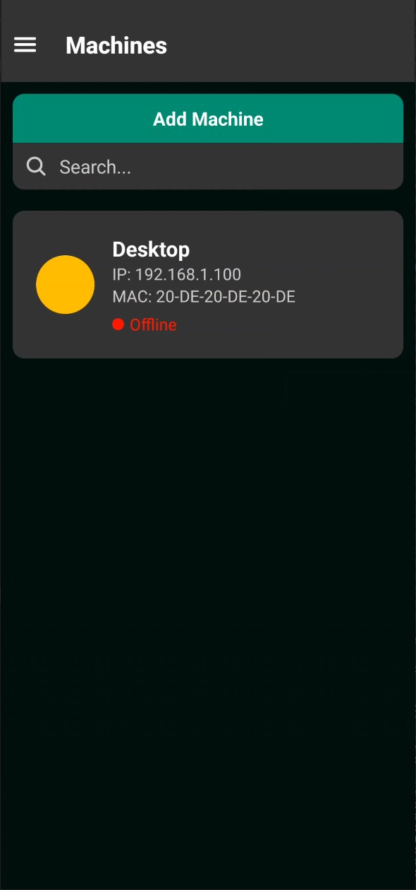
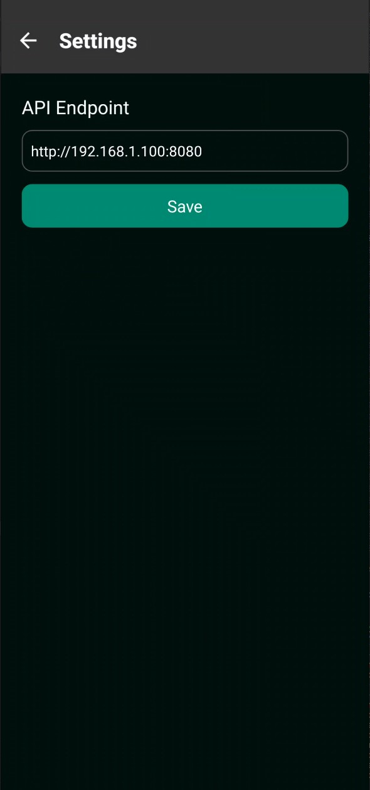
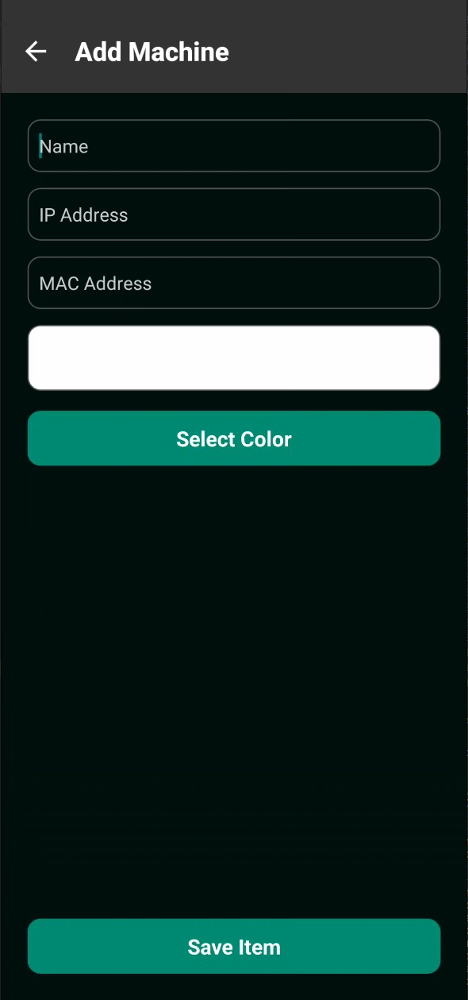

# WOL-Client

WOL-Client is an Android mobile app designed to remotely wake up computers using the [WOL-Docker-API](https://github.com/ThatGuyThimo/WOL-Docker-API). This app provides an intuitive interface for managing and controlling devices through Wake-on-LAN functionality.

---

## Features

- **API Integration**: Configure the app to use a custom API endpoint for communication with the WOL-Docker-API server.
- **Manage Computers**:
  - Add computers by specifying a name, IP address, MAC address, and a custom color for easier identification.
  - Edit or delete computers from the list by holding down on an entry.
- **Wake-on-LAN**:
  - Wake up a computer by tapping its entry in the list.
  - View the current status of the machine:
    - **Active**: The machine is online.
    - **Offline**: The machine is offline.
    - **Unknown**: Status could not be determined (e.g., endpoint connection issue or status not fetched).

---

## Getting Started

### Build

To build the project using Gradle:

1. Clone the repository:
   ```bash
   git clone https://github.com/ThatGuyThimo/WOL-Client.git
   ```
2. Navigate to the project directory:
   ```bash
   cd WOL-Client/android
   ```
3. Build the APK using Gradle:
   ```bash
   ./gradle assembleRelease
   ```
4. Find the generated APK in the `app/build/outputs/apk/debug/` directory.

---

### Prerequisites

- Android device with Android 6.0 (Marshmallow) or higher.
- A running instance of the [WOL-Docker-API](https://github.com/ThatGuyThimo/WOL-Docker-API).

---

### Installation

Download the latest release from the [Releases page](https://github.com/ThatGuyThimo/WOL-Client/releases).

---

### Configuration

1. Open the app.
2. Navigate to the settings page.
3. Enter the API endpoint for the WOL-Docker-API server.

---

### Adding Computers

1. Tap the "Add Computer" button.
2. Fill in the details:
   - **Name**: Friendly name for the machine.
   - **IP Address**: Local or external IP of the machine.
   - **MAC Address**: The machine's hardware address.
   - **Color**: Select a color for visual distinction.
3. Save the details to add the machine to the list.

---

### Managing Computers

- **Edit/Delete**: Long-press a machine in the list to edit or delete its details.
- **Wake Up**: Tap a machine to send a Wake-on-LAN signal.

---

## Screenshots


#### Main List


#### Settings Page


#### Add/Edit Computer



---

## Contributing

Contributions are welcome! To get started:

1. Fork the repository.
2. Create a new branch for your feature or bug fix.
3. Commit your changes.
4. Submit a pull request.

---

## License

This project is licensed under the MIT License. See the [LICENSE](LICENSE) file for details.

---

For more details about the API server, visit the [WOL-Docker-API repository](https://github.com/ThatGuyThimo/WOL-Docker-API).\
